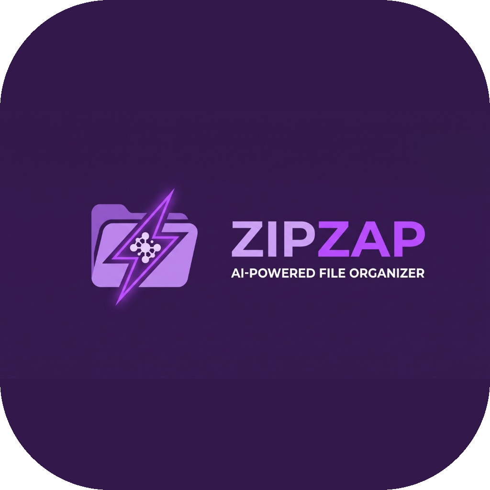

<div align="center">
  
  
  # ⚡ ZipZap: AI-Powered File Organizer
  
  **ระบบจัดการไฟล์อัจฉริยะที่ขับเคลื่อนด้วยพลัง AI (Google Gemini)** 
  
  [](https://github.com/poko56/ZipZap/actions/workflows/build.yml)
</div>

---

## 🌟 ฟีเจอร์หลัก (Features)

ZipZap ไม่ได้เป็นแค่โปรแกรมจัดการไฟล์ธรรมดา แต่มันสามารถ "เข้าใจ" ไฟล์ของคุณได้ผ่าน AI:

*   🤖 **AI Smart Rename (ตั้งชื่อไฟล์อัจฉริยะ):** ให้ AI (Gemini 1.5 Flash) ช่วยวิเคราะห์เนื้อหาในรูปภาพ (JPG, PNG) หรือเอกสาร (PDF, TXT) แล้วตั้งชื่อไฟล์ให้ใหม่สื่อความหมายโดยอัตโนมัติ
*   💬 **Chat with Your Files (คุยกับไฟล์ของคุณ):** ถามคำถามกับ AI เกี่ยวกับไฟล์ในโฟลเดอร์ของคุณ เช่น "มีไฟล์รูปที่ถ่ายปีที่แล้วไหม" ระบบจะตอบโต้และค้นหาให้
*   📂 **Auto Organize (จัดหมวดหมู่ไฟล์อัตโนมัติ):** จัดกลุ่มไฟล์รกๆ เข้าโฟลเดอร์ตามประเภท (รูปภาพ, เอกสาร, วิดีโอ ฯลฯ) ในคลิกเดียว
*   🗑️ **Storage Cleaner (ล้างไฟล์ขยะ):** ค้นหาและลบไฟล์ขนาดใหญ่, ไฟล์ซ้ำ หรือไฟล์ชั่วคราวเพื่อคืนพื้นที่ว่างให้เครื่อง
*   👁️ **Folder Watcher (เฝ้าดูโฟลเดอร์):** ระบบติดตามการเปลี่ยนแปลง เมื่อมีไฟล์ใหม่เข้ามา ระบบจะจัดการให้โดยอัตโนมัติตามกฎที่ตั้งไว้

### 🛠️ เครื่องมือเสริม (Utilities)
*   **บีบอัดรูปภาพ:** ลดขนาดรูปภาพโดยยังคงความชัด (รองรับ HEIC, WEBP)
*   **แปลงไฟล์ Word เป็น PDF:** แปลงไฟล์ `.docx` เป็น `.pdf` ได้รวดเร็ว
*   **แยกเสียงจากวิดีโอ:** ดึงเสียงจาก MP4, MKV ออกมาเป็นไฟล์ MP3 

---

## 🚀 การติดตั้งและใช้งาน (Installation)

### 📦 ดาวน์โหลดแอปสำเร็จรูป (พร้อมใช้งาน)
คุณสามารถดาวน์โหลดแอปที่ Build เสร็จแล้วได้จากหน้า **[Releases](https://github.com/poko56/ZipZap/releases)** หรือจาก GitHub Actions (อัปเดตล่าสุดตลอดเวลา):
1. ไปที่แท็บ **[Actions](https://github.com/poko56/ZipZap/actions)** ใน GitHub
2. เลือก Workflow "Build ZipZap" ที่รันสำเร็จล่าสุด
3. เลื่อนลงมาด้านล่างที่หมวด **Artifacts** จะมีให้ดาวน์โหลดทั้งสำหรับ **Windows** (`.exe`) และ **macOS** (`.app`)

> **Note:** สำหรับ macOS หากเปิดแอปแล้วขึ้นเตือนความปลอดภัย (Gatekeeper) ให้ทำการ **คลิกขวาที่แอป -> เลือก Open** เพื่ออนุญาตการใช้งานในครั้งแรก

### 💻 รันจาก Source Code (สำหรับนักพัฒนา)
หากต้องการรันด้วยตัวเอง หรือนำไปพัฒนาต่อ:

1. **Clone Repository:**
   ```bash
   git clone https://github.com/poko56/ZipZap.git
   cd ZipZap
   ```

2. **ติดตั้ง Dependencies:**
   ต้องใช้ Python 3.9+ 
   ```bash
   pip install -r requirements.txt
   ```

3. **เตรียม API Key:**
   เพื่อให้ AI ทำงานได้ คุณต้องมี **Gemini API Key** 
   - สร้างไฟล์ชื่อ `api_key.txt` ในโฟลเดอร์เดียวกับโค้ด
   - นำ API Key วางไว้ในไฟล์นั้น

4. **รันแอป:**
   ```bash
   python main.py
   ```

---

## 🛠️ เทคโนโลยีที่ใช้ (Tech Stack)
*   **Python 3:** ภาษาหลักในการพัฒนา
*   **CustomTkinter:** ออกแบบหน้าตา UI ที่ดูทันสมัยและรองรับ Dark Mode
*   **Google GenAI SDK:** เชื่อมต่อกับโมเดล Gemini 1.5 Flash สำหรับระบบวิเคราะห์ไฟล์และการแชท
*   **PyInstaller:** ใช้สำหรับแพ็คโค้ดให้กลายเป็นแอปพลิเคชัน (Executable)
*   **GitHub Actions:** ทำ CI/CD สำหรับบิ้วแอป Windows และ Mac อัตโนมัติ พร้อมระบบซ่อน API Key อย่างปลอดภัย

---

## ⚠️ หมายเหตุเกี่ยวกับ API Key ใน GitHub Actions
โปรเจกต์นี้ตั้งค่าให้ดึง API Key จาก **GitHub Secrets** เพื่อฝังเข้าไปในตัวแอปขณะบิ้วโดยอัตโนมัติ ทำให้ผู้ใช้ไม่ต้องกรอก Key เอง
หากคุณ Fork โปรเจกต์นี้ไปทำต่อ อย่าลืมเข้าไปตั้งค่าใน:
`Settings -> Secrets and variables -> Actions -> New repository secret`
โดยตั้งชื่อตัวแปรว่า `GEMINI_API_KEY`

---
*Developed with ❤️*